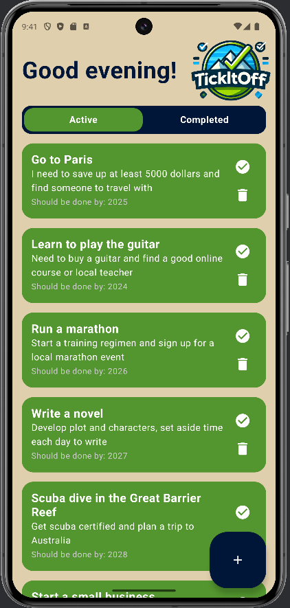
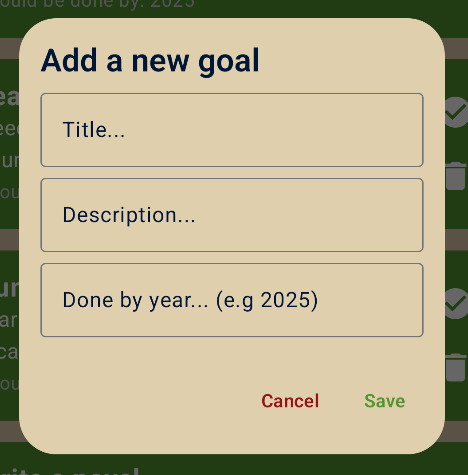
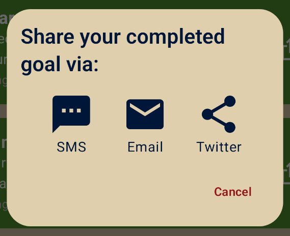

# TickItOff 🎯

**TickItOff** is a bucket list app where users can set goals they aspire to achieve by a specific year. This Android app, developed in Kotlin using Jetpack Compose, allows users to track their progress, mark goals as complete, and share accomplishments with friends. Built as part of the MPROG course at Stockholm University.

This app was the winner of best developed mobile app in the course! 🏆

## Features ✨

- **Add Goals**: Create a list of goals you aim to complete by a set year.
- **Mark Complete**: Mark goals as completed once achieved, and view all accomplishments in a summary.
- **Delete Goals**: Optionally delete goals (although it’s recommended to try completing them first!).
- **Share Achievements**: Share completed goals with friends via email, SMS, or Twitter, using a pre-filled message for inspiration that users can customize.
- **Reminder Notifications**: App has weekly reminder notifications to encourage them to set new goals.

## Technologies Used 🛠️

- **Kotlin**: Main programming language.
- **Jetpack Compose**: A declarative UI framework by Google for building Android apps.
- **Room Database**: Provides an abstraction layer over SQLite for database management.

## Video walkthrough of the app 🎥
Watch a demo of **TickItOff** on [YouTube](https://www.youtube.com/watch?v=mAOkPEfctAw).

## Screenshots 📸

### Main Screen

  
  

    <h3>Add New Goal Dialog</h3>
    
  

  

    <h3>Share A Completed Goal Dialog</h3>
    
  

### Animated Menu Switch

## Folder Structure 📂

The source code is organized into five main packages, each with a specific role:

- ### `data`
  - Contains the database definitions, the `BucketListItem` data class, and the `Data Access Object (DAO)` interface, which is used to perform database operations.

- ### `events`
  - Manages user interactions by defining various events that occur within the app.

- ### `ui`
  - Encompasses all graphical components for the user interface, including dialogs, individual screen components, and styles.
  - Contains three sub-packages:
    - **`components`**: Custom reusable UI components.
    - **`screens`**: Definitions of the app's screens and layouts.
    - **`theme`**: Style and theme settings for consistent design.

- ### `utils`
  - Utility classes for notifications, network checks, and additional functionality, such as triggering mobile vibrations for interactions.

- ### `viewmodel`
  - Holds files responsible for managing and storing the app’s state in a way that survives UI changes. This package bridges the user interface with the data layer.

## Future Improvements 🔮
Some ideas for enhancing the app:
- Providing customizable categories for goal organization.
- Adding progress tracking for partially completed goals.
- Calendar integration for more specific dates
